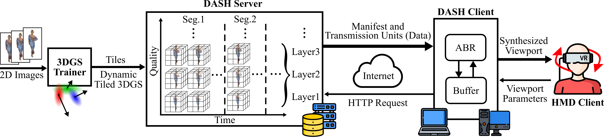

# LTS: A DASH Streaming System for Dynamic Multi-Layer 3D Gaussian Splatting Scenes

| [Paper](https://dl.acm.org/doi/10.1145/3712676.3714445) | [Video](https://youtu.be/KfSS-uwPFXk) |<br>

[Yuan-Chun Sun](https://syjintw.github.io/) <sup>1</sup>,
[Yuang Shi](https://yuang-ian.github.io/) <sup>2</sup>,
[Cheng-Tse Lee](#) <sup>1</sup>,
[Mufeng Zhu](https://jackiezhuzzz.github.io/) <sup>3</sup>,
[Wei Tsang Ooi](https://www.comp.nus.edu.sg/~ooiwt/) <sup>2</sup>,
[Yao Liu](https://yaoliu-yl.github.io/) <sup>3</sup>,
[Chun-Ying Huang](https://people.cs.nycu.edu.tw/~chuang/) <sup>4</sup>,
[Cheng-Hsin Hsu](https://aiins.cs.nthu.edu.tw/cheng-hsin-hsu/) <sup>1</sup> <br>
 <sup>1</sup> National Tsing Hua University, <sup>2</sup> National University of Singapore, <sup>3</sup> Rutgers University, <sup>4</sup> National Yang Ming Chiao Tung University <br>
 <br> 

Official implementation of DASH streaming system for dynamic 3DGS.<br>
**Accepted by ACM Multimedia Systems Conference 2025 (MMSys'25)** <br>
**ACM Multimedia Systems Conference 2025 (MMSys'25) Best Paper Award**

<p float="middle">
  
</p>

## Code Availability Notice
At present, we are unable to release the source code publicly. We have received notice from a company asserting that portions of our work may overlap with their patents related to viewport-dependent streaming. In light of this potential legal issue, we cannot make the code or scripts openly available.

The authors, however, remain open to technical discussions and are willing to provide clarifications regarding the implementation through academic or professional exchange.

## Citation
```
@inproceedings{sun2025lts,
  title={LTS: A DASH streaming system for dynamic multi-layer 3D Gaussian splatting scenes},
  author={Sun, Yuan-Chun and Shi, Yuang and Lee, Cheng-Tse and Zhu, Mufeng and Ooi, Wei Tsang and Liu, Yao and Huang, Chun-Ying and Hsu, Cheng-Hsin},
  booktitle={Proceedings of the 16th ACM Multimedia Systems Conference},
  pages={136--147},
  year={2025}
}
```
